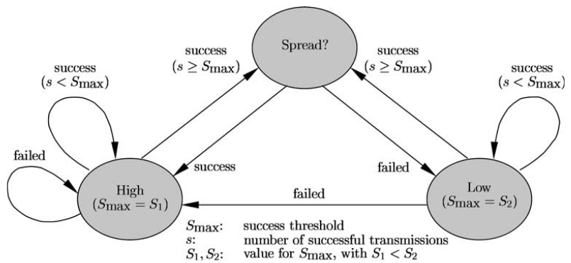

++++++++++++++++++
APARF User Manual
++++++++++++++++++

This document describes the **Adaptive Power Auto Rate Fallback (APARF)**
algorithm, and acts as a user manual for its
implementation in ns3.

Algorithm Synopsis
==================

APARF is a link adaptation algorithm, that dynamically adjusts both
the transmit power level and the data rate based on the radio channel
conditions. It is compatible with the IEEE 802.11 wireless LAN standard.

The algorithm **relies solely on the link quality information available at the
transmitter.** This information is indicated by the reception or non-reception
of the acknowledgement (ACK) frames. Unlike several other algorithms, this
algorithm **does not make use of the RTS-CTS**
(Request To Send - Clear To Send) mechanism, and **neither does it pass on
link information from the receiver to the transmitter.**

APARF can be operated in several modes, depending on situational factors such as:
    * The service requirements (Target data rate, delay constraints, etc.)
    * Number of stations in the network
    * The scenarios being considered (Fairness constraints)

The 3 modes of operation are as follows:
    * **High Performance Mode** - The system tries to drive up the data rates to minimise transmission delays and maximise throughput.
    * **Low Power Mode** - The goal is to reduce transmit power level, by sacrificing the throughput gain.
    * **Single Parameter Adaptation** - Either the transmit power level or the data rate is kept fixed.

Key Assumptions made:
~~~~~~~~~~~~~~~~~~~~~
    * Power consumed during idle times (DIFS, SIFS) not considered.
    * As the ACK procedure's reliability is crucial for the system, it is assumed that all ACK frames are transmitted at the highest power level.

Joint Power and Data Rate Adaptation:
~~~~~~~~~~~~~~~~~~~~~~~~~~~~~~~~~~~~~

As mentioned before, the ACK mechanism is used to detect a frame loss. If an
ACK for a frame is not received in a certain time frame, the algorithm concludes
that the link quality was insufficient and that a lower data rate or higher
transmission power should be utilised.

Conversely, if ACK is received for multiple frames successfully, the algorithm
concludes that the link quality is sufficient and that a higher data rate or
lower transmit power can be used.

Each node maintains 2 counters *s* and *f* to keep track of number of successive
transmission successes and failures respectively. Whenever either is incremented,
the other is set to 0. Further, thresholds S\ :sub:`max` and F\ :sub:`max` are 
maintained. Whenever *s* reaches S\ :sub:`max`, the data rate is increased or
the power is increased and both counters are reset to 0. Similarly, when *f*
reaches F\ :sub:`max`, the data rate is decreased or power is increased and both
counters are reset to 0.

By default, F\ :sub:`max` = 1. The choice for S\ :sub:`max` depends on the state
of the channel. Fast changing channel dynamics call for a lower value of S\ :sub:`max`
and stable channel dynamics allow for a higher value. 

A good understanding of the algorithm can be developed by observing this 
state diagram:

The algorithm operates in 3 states:
    * High - 
    * Low - 
    * Spread? - 

